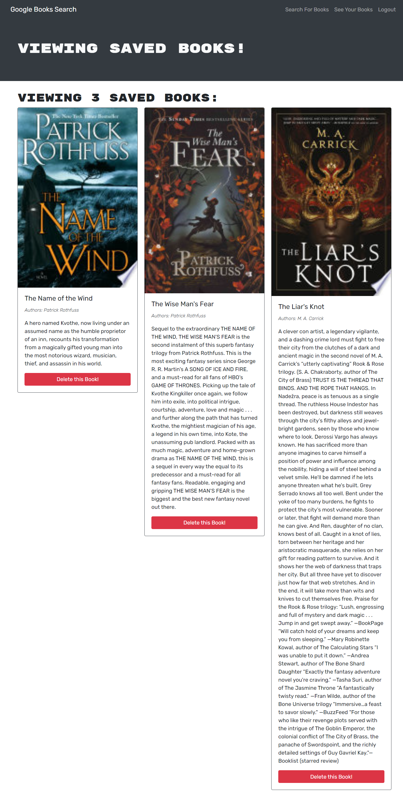

# Ready-to-Read-Book-Search
    

## Description
Personalizing our data has become an essential feature of almost any web application. Ready to Read allows the user to search for books (using the [Google Books API](https://developers.google.com/books) to fetch book data), and save searched books so they can build a reading list or just for future reference.  This is a full stack MERN application that utilizes a query based server, [Apollo Server](https://www.apollographql.com/docs/apollo-server/).

### Deployed Application
[Ready to Read](https://ready-to-read.herokuapp.com/)

## Table of Contents

- [Usage](#usage)
- [License](#license)
- [Contributing](#contributing)
- [Questions](#questions)

## Usage
In the top right corner, click the `Login/Sign Up` button to create an account. Enter the title of a book in the search bar and hit `Submit Search`. You'll see a list of books that match your query that includes a picture of the cover, the title, and a description. Click the `Save this Book!` button to save the book to your list. To view your list of saved books, click the `See Your Books` link at the top of the webpage. If you wish to delete a book from your list, click on the `Delete this Book` button beneath the description of the book.

## License
This project is covered under the MIT license:
[License: MIT](https://github.com/ggorosave/Ready-to-Read-Book-Search/blob/main/LICENSE)

## Contributing

If you are interested in contributing to this project or have some ideas about how to improve it, you may fork this repository and make your desired changes. When you have finished, send a pull request and I will review it when I have a chance.

## Questions

If you have any questions about the repo, contact me at [ggorosave@gmail.com](mailto:ggorosave@gmail.com) or through [LinkedIn](https://www.linkedin.com/in/grantgorosave/). Find more of my work at [ggorosave](https://https://github.com/ggorosave).